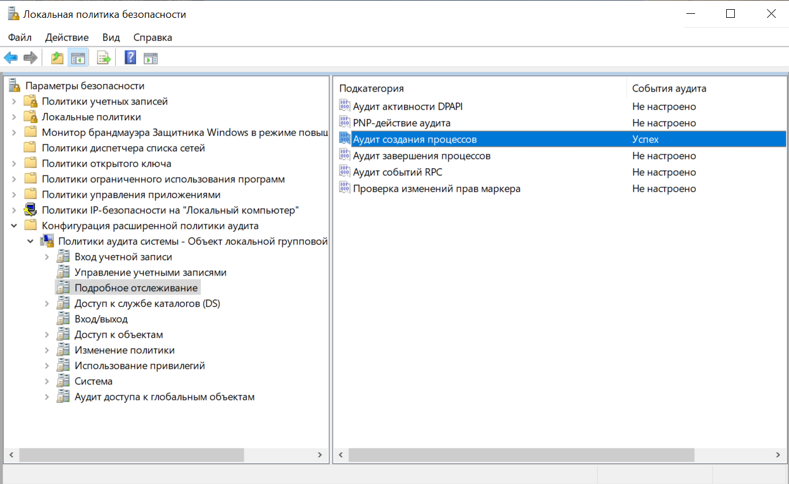
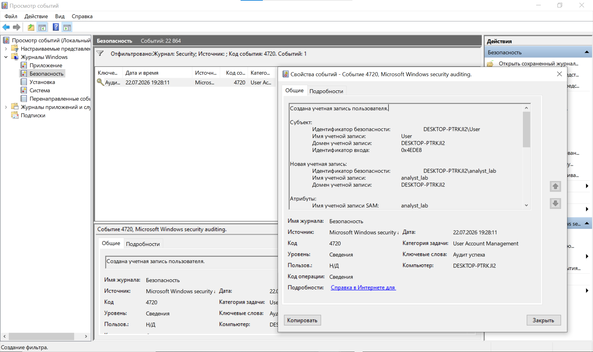
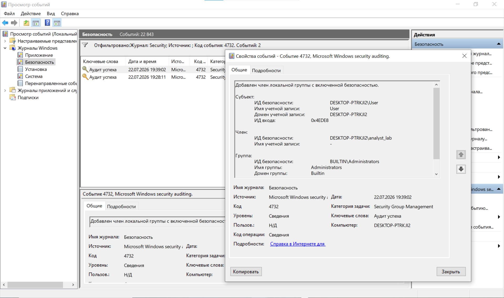
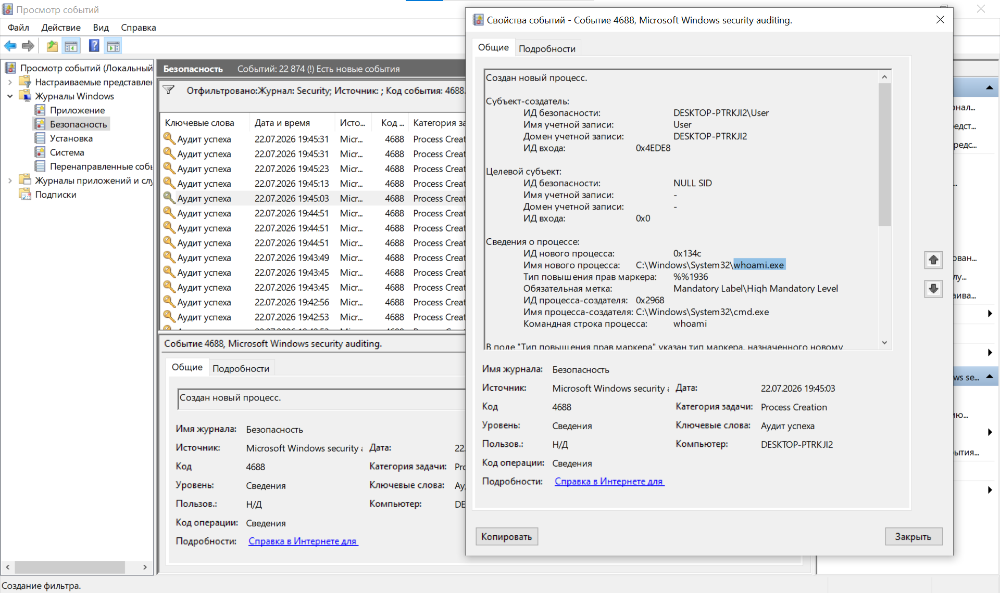
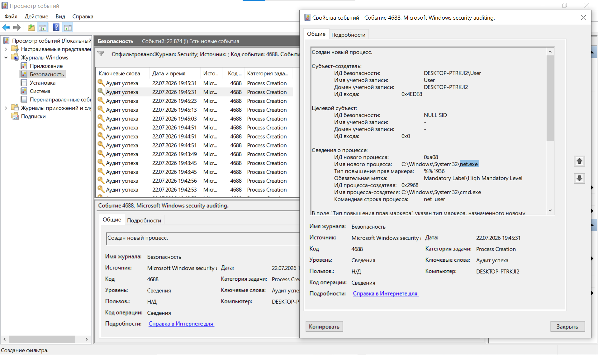
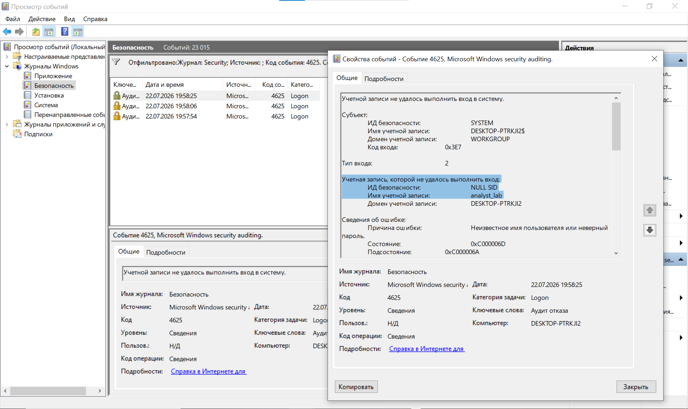
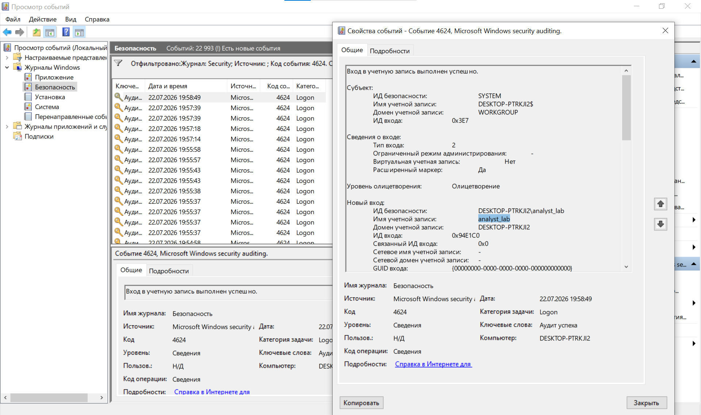
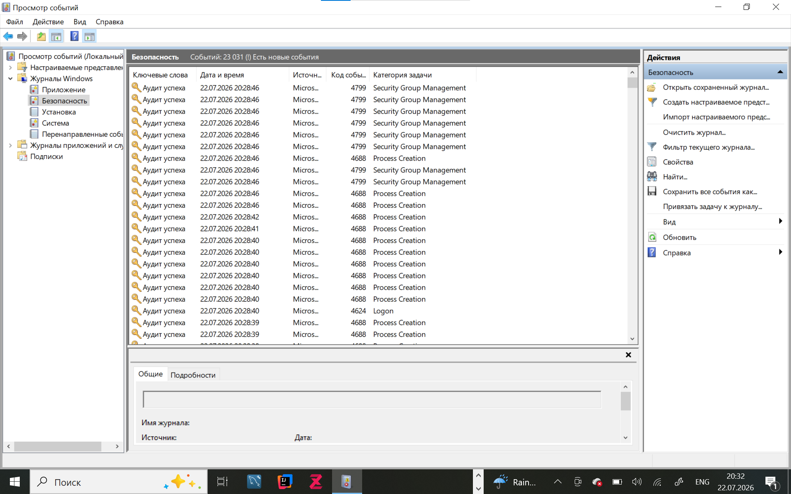
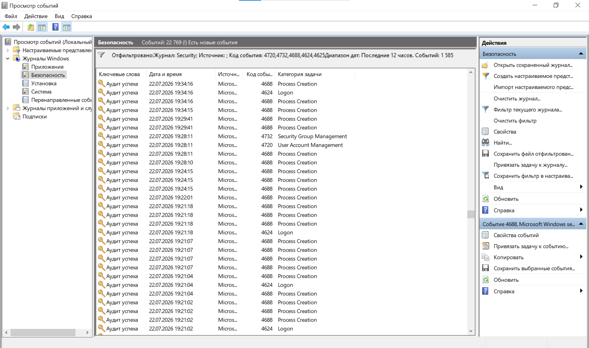

# Incident Report

## Executive Summary

A Windows Security Log investigation identified suspicious local account activity.

A new local account named **analyst_lab** was created and added to the local **Administrators** group.

System discovery commands were executed, followed by failed and successful logon activity.

The investigation used Windows Security Event Logs to reconstruct the sequence of events.

---

## Environment

- Operating System: Windows 10
- Log Source: Windows Security Event Log
- Analysis Tool: Event Viewer
- Suspicious Account: `analyst_lab`
- Local Group: `Administrators`

---

## Investigation

### 1. Audit Policy Configuration

Windows auditing was enabled before generating the test activity.

The following categories were configured:

- Logon auditing
- User Account Management auditing
- Security Group Management auditing
- Process Creation auditing
- Command-line logging for process creation events



This configuration allowed the system to record the account, logon, group membership, and process creation events used in the investigation.

---

### 2. Local User Account Creation

A new local account named `analyst_lab` was created.

The activity generated **Event ID 4720**, which means that a user account was created.



Important evidence:

- Event ID: `4720`
- New account: `analyst_lab`
- Activity: Local user account creation

Creating an unexpected local account can be suspicious, especially when the account is later given elevated privileges.

---

### 3. Account Added to Administrators

The new account was added to the local `Administrators` group.

This activity generated **Event ID 4732**.



Important evidence:

- Event ID: `4732`
- Account: `analyst_lab`
- Group: `Administrators`
- Activity: Privilege elevation through group membership

This increased the permissions of the account and allowed it to perform administrative actions on the system.

---

### 4. Process Creation: whoami

The `whoami` command was executed.

This activity generated **Event ID 4688**, which records the creation of a new process.



Important evidence:

- Event ID: `4688`
- Process: `whoami.exe`
- Command line: `whoami`
- Parent process: `cmd.exe`

The `whoami` command shows the identity and security context of the current user.

It is commonly used by administrators, but it can also be used by an attacker after gaining access to a system.

---

### 5. Process Creation: net user

The `net user` command was executed to list local user accounts.



Important evidence:

- Event ID: `4688`
- Process: `net.exe`
- Command line: `net user`
- Activity: Account discovery

The `net user` command can be used to identify available local accounts and understand the system environment.

---

### 6. Failed Logon Attempts

Several incorrect passwords were entered for the `analyst_lab` account.

This generated **Event ID 4625**, which represents a failed logon.



Important evidence:

- Event ID: `4625`
- Account: `analyst_lab`
- Result: Failed logon
- Failure reason: Incorrect username or password

Multiple failed logons can indicate a user mistake, password guessing, or a brute-force attempt.

---

### 7. Successful Logon

After the failed attempts, a successful logon was recorded.

This generated **Event ID 4624**.



Important evidence:

- Event ID: `4624`
- Account: `analyst_lab`
- Result: Successful logon

The successful logon confirmed that the account was active and could access the system.

---

## Security Log Overview

The Windows Security log contained the events used during the investigation.



The log contained many normal system events. The investigation focused on the event IDs related to the suspicious account activity.

---

## Investigation Timeline

The Security log was filtered using the following Event IDs:

```text
4720, 4732, 4688, 4625, 4624
```



The filtered view helped correlate the important events and reconstruct the sequence of activity.

---

## Timeline Summary

| Order | Event ID | Activity |
|------:|---------:|----------|
| 1 | 4720 | Local account `analyst_lab` was created |
| 2 | 4732 | The account was added to `Administrators` |
| 3 | 4688 | The `whoami` command was executed |
| 4 | 4688 | The `net user` command was executed |
| 5 | 4625 | Failed logon attempts were recorded |
| 6 | 4624 | A successful logon was recorded |

---

## MITRE ATT&CK Mapping

| Technique | ID | Evidence |
|-----------|----|----------|
| Create Account: Local Account | T1136.001 | Account `analyst_lab` was created |
| Account Manipulation | T1098 | Account was added to `Administrators` |
| System Owner/User Discovery | T1033 | `whoami` was executed |
| Account Discovery | T1087.001 | `net user` was executed |

---

## Analysis

The investigation identified a clear sequence of suspicious activity:

1. A new local account was created.
2. The account received administrator privileges.
3. System discovery commands were executed.
4. Failed logon attempts occurred.
5. The account successfully logged in.

In a real environment, this sequence could indicate unauthorized account creation, privilege escalation, and post-access discovery.

However, this project was completed in a controlled lab environment, and the activity was generated intentionally for training purposes.

---

## Recommended Response Actions

In a real incident, the following actions should be considered:

1. Disable or remove the suspicious account.
2. Remove the account from the Administrators group.
3. Review who created the account and whether the action was authorized.
4. Investigate other commands and processes executed by the account.
5. Review logon source information and logon types.
6. Check for additional persistence mechanisms.
7. Reset affected credentials if compromise is suspected.
8. Continue monitoring the endpoint for suspicious activity.

---

## Conclusion

The investigation successfully reconstructed suspicious local account activity using Windows Security Event Logs.

By correlating Events `4720`, `4732`, `4688`, `4625`, and `4624`, it was possible to identify account creation, privilege elevation, system discovery, and logon activity.

This project demonstrates practical skills in Windows log analysis, event correlation, incident investigation, and MITRE ATT&CK mapping.
