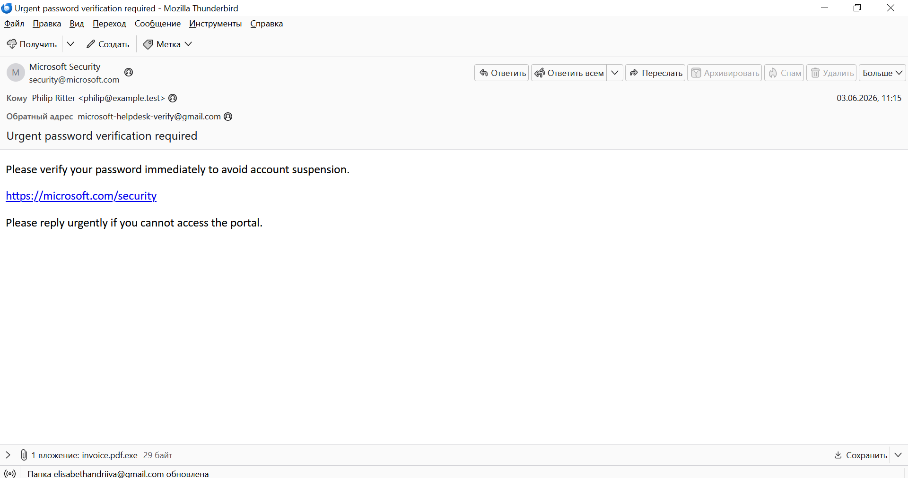
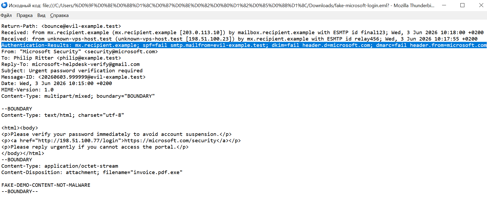
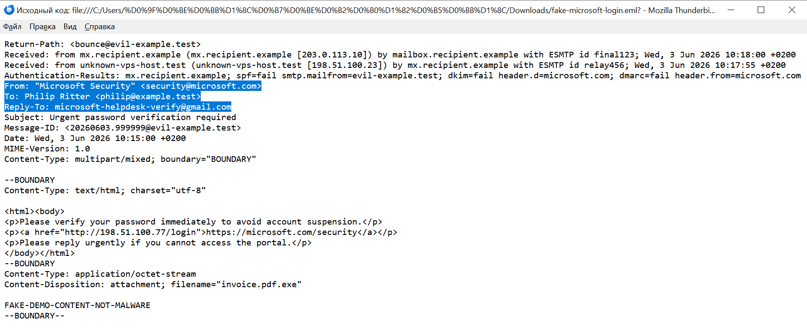
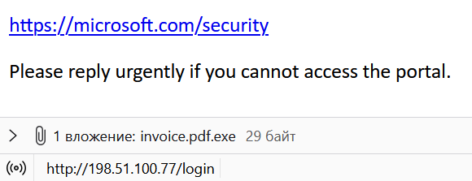
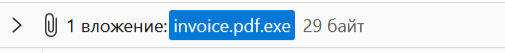

# Phishing Email Investigation

## Project Overview

In this project, I analyzed a safe training email that pretended to come from Microsoft Security.

The email asked the user to verify their password. It also contained a fake link and an executable attachment disguised as a PDF file.

The main goals were to:

- check the sender's information;
- analyze the email headers;
- inspect the link and attachment;
- find signs of phishing;
- collect indicators;
- decide how the email should be handled.

> **Note:** This project uses safe training data. The email does not contain real malware. The domains and IP addresses are examples created for documentation and testing.

## Scenario

A user received an email with the subject:

`Urgent password verification required`

The email claimed to come from Microsoft Security. It warned the user that the account could be suspended unless the password was verified immediately.

The email was reported to the SOC team for investigation.

## Tools Used

- Mozilla Thunderbird
- Email source view
- Manual email header analysis
- GitHub Markdown

## Evidence

- [Training email sample](evidence/fake-microsoft-login.eml)
- [Full investigation report](report.md)
- [Indicators found during the investigation](iocs.md)
- [Investigation screenshots](screenshots/)

## Main Findings

| Finding | What I Found | Risk |
|---|---|---|
| Urgent language | The email asked the user to act immediately | Medium |
| Sender mismatch | The email claimed to be from Microsoft, but other header fields used different domains | High |
| Reply-To mismatch | Replies were sent to a Gmail address instead of Microsoft | High |
| SPF failure | The email did not pass the SPF check | High |
| DKIM failure | The email did not pass the DKIM check | High |
| DMARC failure | The email did not pass the DMARC check | High |
| Fake link | The visible Microsoft link opened a different address | High |
| Suspicious attachment | The attachment was an `.exe` file disguised as a PDF | Critical |

## Screenshots

### 1. Email Overview

The email pretends to come from Microsoft Security. It uses urgent language and asks the user to verify a password.

### 2. Email Authentication Failures

The email failed SPF, DKIM, and DMARC checks. This means the sender could not prove that the email was a real Microsoft message.

### 3. Sender and Reply-To Mismatch

The visible sender address is:

`security@microsoft.com`

However, replies are sent to:

`microsoft-helpdesk-verify@gmail.com`

A real Microsoft security email should not normally ask the user to reply to an unrelated Gmail address.

### 4. Link Mismatch

The user sees this link:

`https://microsoft.com/security`

However, the real destination is:

`http://198.51.100.77/login`

The visible link and the real destination are different. This is a common phishing technique.

### 5. Suspicious Attachment

The attachment is named:

`invoice.pdf.exe`

The final extension is `.exe`, so this is an executable file, not a PDF document.

## Final Verdict

**Phishing simulation — High severity**

The email contains several strong signs of phishing:

- it pretends to be from Microsoft;
- SPF, DKIM, and DMARC checks failed;
- the Reply-To address does not match the sender;
- the visible link hides a different destination;
- the attachment is an executable file disguised as a PDF;
- the message uses urgency to pressure the user.

This is a safe training email, so no real malware was used.

## Recommended Actions

- Quarantine the email.
- Search for similar emails in other mailboxes.
- Block the suspicious email address and link.
- Ask the user whether they clicked the link or opened the attachment.
- Reset the user's password if credentials were entered.
- Review login and endpoint logs if the user interacted with the email.
- Remind users to report suspicious emails.

## Skills Demonstrated

- Phishing email analysis
- Email header analysis
- SPF, DKIM, and DMARC checks
- Sender and Reply-To comparison
- Link inspection
- Attachment analysis
- Indicator collection
- Incident reporting
