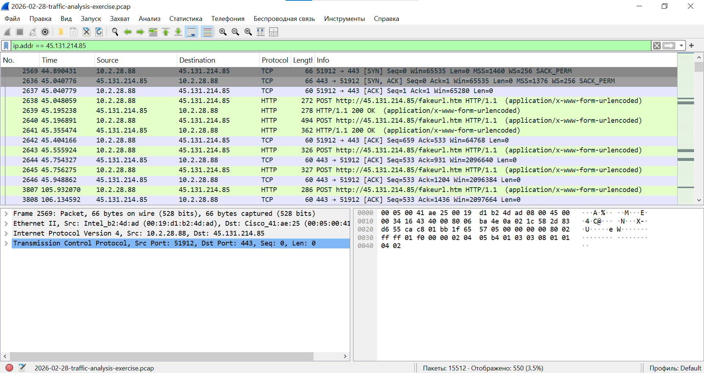
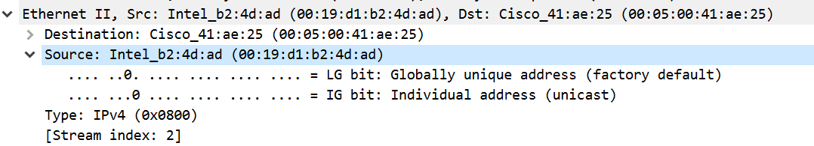
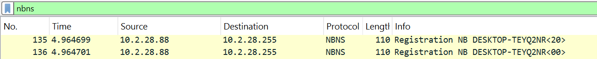
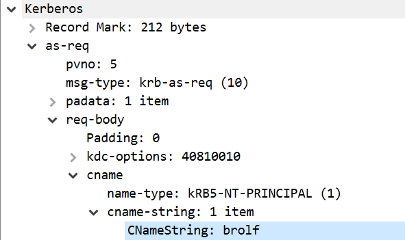
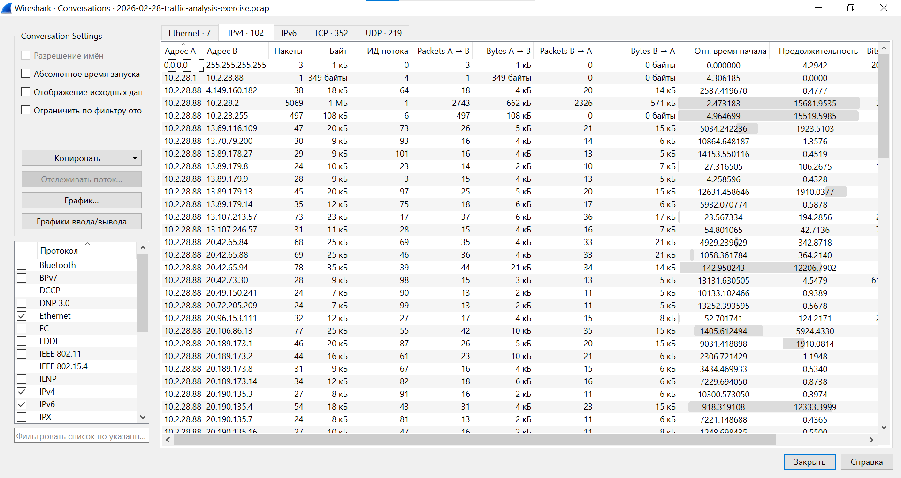
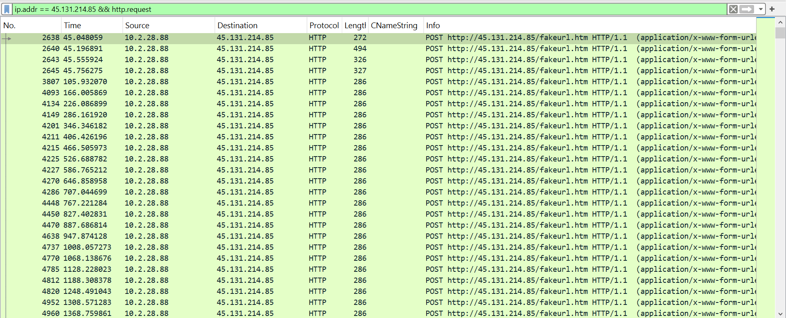
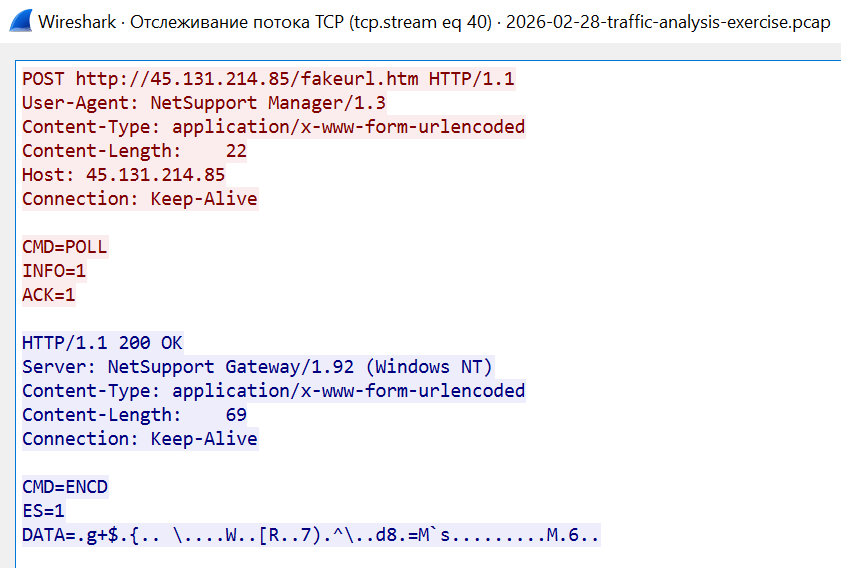

# Network Traffic Investigation Report

## Case Summary

A SIEM alert showed traffic related to NetSupport Manager RAT.

The suspicious external IP was:

`45.131.214.85`

The goal was to identify the infected Windows computer and review its network traffic.

## Tools

- Wireshark
- Display filters
- Follow TCP Stream
- Wireshark Statistics

## Investigation Results

| Item | Result |
|---|---|
| Infected IP | `10.2.28.88` |
| MAC address | `00:19:d1:b2:4d:ad` |
| Hostname | `DESKTOP-TEYQ2NR` |
| User account | `brolf` |
| Full name | `Gabriel Wyatt` |
| Suspicious IP | `45.131.214.85` |
| Suspicious URL | `http://45.131.214.85/fakeurl.htm` |
| User-Agent | `NetSupport Manager/1.3` |

## Investigation

### 1. Infected Host

I filtered the traffic by the suspicious IP:

```text
ip.addr == 45.131.214.85
```

The internal host `10.2.28.88` was communicating with the suspicious server.



### 2. MAC Address

I checked the Ethernet information of a packet sent by `10.2.28.88`.

The source MAC address was:

`00:19:d1:b2:4d:ad`



### 3. Hostname

I used the following filter:

```text
nbns
```

The NBNS traffic showed the hostname:

`DESKTOP-TEYQ2NR`



### 4. User Account

I reviewed a Kerberos AS-REQ packet.

The `CNameString` field showed the user account:

`brolf`



### 5. Network Conversations

The Conversations window showed communication between the infected host, the domain controller, and external systems.



### 6. Suspicious HTTP Traffic

I used this filter:

```text
ip.addr == 45.131.214.85 && http.request
```

The infected host sent repeated HTTP POST requests to:

`http://45.131.214.85/fakeurl.htm`



### 7. TCP Stream

I followed one of the TCP streams.

The stream showed:

- HTTP POST requests;
- `NetSupport Manager/1.3` as the User-Agent;
- communication with `45.131.214.85`;
- `CMD=POLL` and `CMD=END` values;
- HTTP `200 OK` responses.



## Conclusion

The infected Windows host was identified as:

`10.2.28.88`

The host communicated with `45.131.214.85` using repeated HTTP POST requests.

The NetSupport Manager User-Agent and command-related traffic support the original SIEM alert.

## Recommended Actions

- Isolate the infected computer.
- Block `45.131.214.85`.
- Search for similar traffic from other computers.
- Review endpoint logs and running processes.
- Run an approved antivirus or EDR scan.
- Reset the user's password if needed.
- Escalate the incident to the incident response team.
