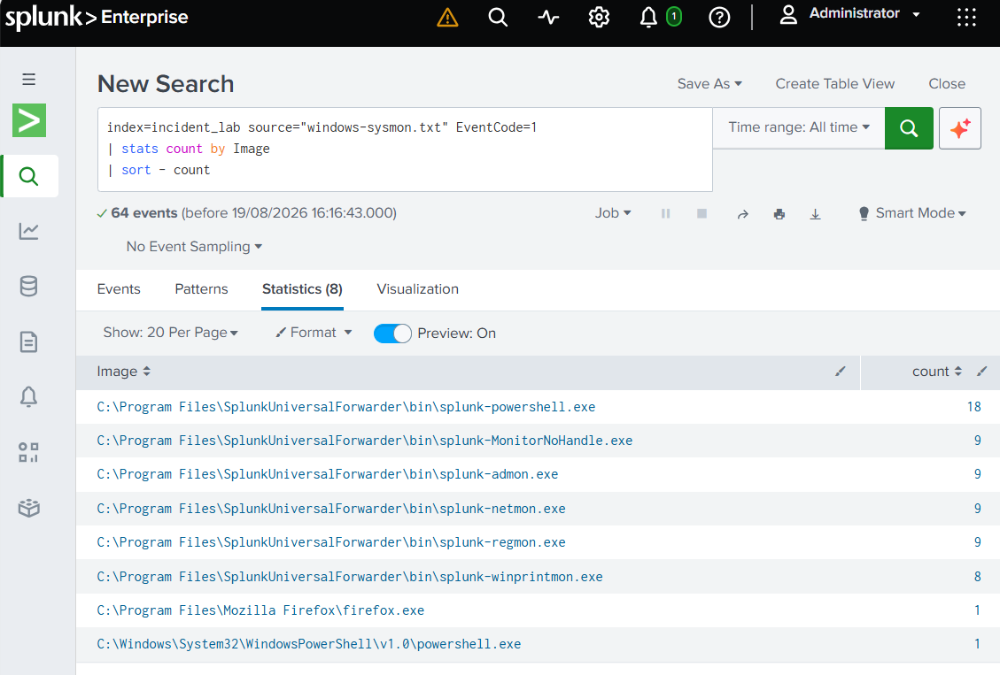
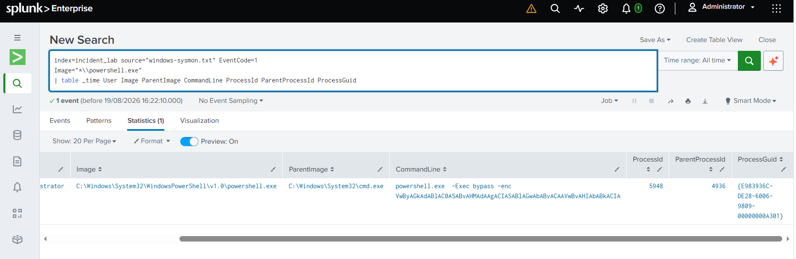
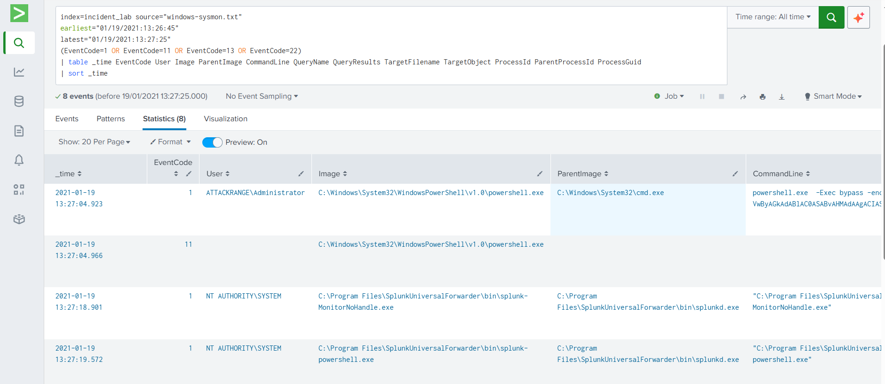
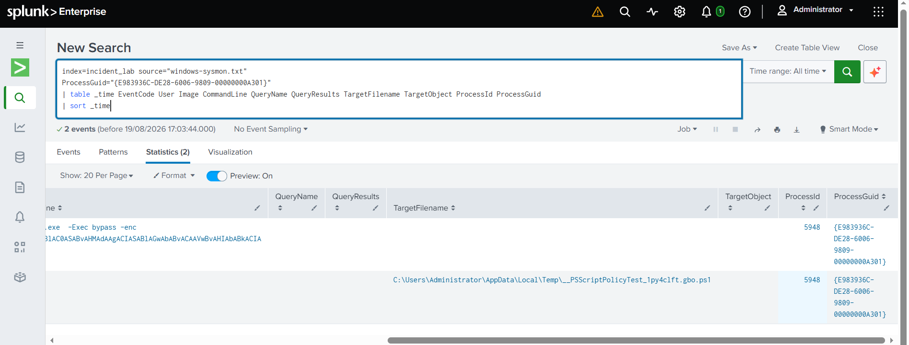

# Incident Investigation Report

## 1. Investigation Summary

Windows Sysmon logs were analyzed in Splunk to investigate suspicious process activity.

During the analysis, a PowerShell process was identified with unusual command-line arguments:

`powershell.exe -Exec bypass -enc ...`

The process was started by `cmd.exe` under the `ATTACKRANGE\Administrator` account.

Because ExecutionPolicy bypass and encoded PowerShell commands can be used during malicious activity, the process was investigated further.

---

## 2. Initial Process Analysis

Sysmon Event ID 1 (Process Creation) events were reviewed to identify processes executed on the system.

The process overview showed mostly Splunk Universal Forwarder processes. However, a Windows PowerShell process was also identified.

### Process Overview

The PowerShell process had the following information:

- User: `ATTACKRANGE\Administrator`
- Image: `C:\Windows\System32\WindowsPowerShell\v1.0\powershell.exe`
- Parent process: `C:\Windows\System32\cmd.exe`
- Process ID: `5948`
- Parent Process ID: `4936`

The command line contained:

`powershell.exe -Exec bypass -enc ...`

The use of ExecutionPolicy bypass and an encoded command made this process interesting for further investigation.

### Suspicious PowerShell Execution

---

## 3. PowerShell Investigation

The PowerShell process was investigated using its Process ID and Process GUID.

Process GUID:

`{E983936C-DE28-6006-9809-00000000A301}`

Using the Process GUID helped correlate different Sysmon events with the same PowerShell process.

Two relevant events were identified around the execution time:

- `13:27:04.923` — Sysmon Event ID 1: PowerShell process creation
- `13:27:04.966` — Sysmon Event ID 11: file creation

The file creation happened only milliseconds after the PowerShell process started.

### PowerShell Event Timeline

---

## 4. Encoded Command Analysis

The PowerShell command used the `-enc` parameter.

The encoded Base64 value was:

`VwByAGkAdABlAC0ASABvAHMAdAAgACIASABlAGwAbABvACAAVwBvAHIAbABkACIA`

After decoding the value as a PowerShell UTF-16LE encoded command, the result was:

`Write-Host "Hello World"`

This was an important part of the investigation.

The original command line looked suspicious because it used both ExecutionPolicy bypass and an encoded command. However, the decoded command itself did not contain a malicious payload.

This reduced the severity of the finding.

---

## 5. File Creation Activity

Sysmon Event ID 11 showed that the investigated PowerShell process created a temporary `.ps1` file:

`C:\Users\Administrator\AppData\Local\Temp\__PSScriptPolicyTest_1py4clft.gbo.ps1`

The event was associated with:

- Process ID: `5948`
- Image: `powershell.exe`
- The same Process GUID as the investigated PowerShell process

This allowed the file creation event to be correlated with the PowerShell execution.

The filename appears to be related to PowerShell script policy testing. Therefore, this file creation alone was not considered evidence of malware.

### Related File Creation

---

## 6. DNS Investigation

Sysmon Event ID 22 (DNS Query) events were reviewed during the investigation.

DNS activity was also checked specifically after the suspicious PowerShell execution.

No DNS events were found in the investigated time window after the PowerShell process started.

Because of this, the available Sysmon data did not show DNS communication related to this PowerShell execution.

---

## 7. Process Activity After PowerShell

Process Creation events after the PowerShell execution were reviewed.

Most of the following processes were related to Splunk Universal Forwarder, including:

- `splunk-MonitorNoHandle.exe`
- `splunk-powershell.exe`
- `splunk-regmon.exe`
- `splunk-admon.exe`
- `splunk-netmon.exe`
- `splunk-winprintmon.exe`

These processes were started by `splunkd.exe` and were not considered part of the investigated PowerShell activity.

No clear malicious child process was identified after the PowerShell execution.

---

## 8. Process Access Investigation

Sysmon Event ID 10 (Process Access) events were also reviewed.

A search was performed for Process Access events where PowerShell Process ID `5948` was the source process.

No matching events were found.

Therefore, the available Sysmon data did not show additional process-access activity from the investigated PowerShell process.

---

## 9. Key Findings

The investigation identified the following:

- PowerShell was launched by `cmd.exe`.
- The process ran under `ATTACKRANGE\Administrator`.
- The command used `-Exec bypass`.
- The command used the `-enc` parameter.
- The encoded command was decoded to `Write-Host "Hello World"`.
- The PowerShell Process ID was `5948`.
- A related temporary `.ps1` file creation event was identified.
- No related DNS activity was identified after the PowerShell execution.
- No malicious child process was identified.
- No Process Access activity from PowerShell PID `5948` was identified.

---

## 10. Assessment

The original PowerShell command line was suspicious because ExecutionPolicy bypass and encoded commands can also be used by attackers to hide PowerShell activity.

However, investigation of the encoded command showed that it only executed:

`Write-Host "Hello World"`

The related `.ps1` file also appeared to be associated with PowerShell script policy testing.

The available Sysmon logs did not show additional evidence such as malicious child processes, related DNS communication, or suspicious Process Access activity.

For these reasons, the activity was investigated as suspicious but was not confirmed as malicious.

Additional evidence would be useful for a stronger conclusion, including:

- PowerShell Script Block Logging
- Endpoint Detection and Response (EDR) telemetry
- Network traffic
- Antivirus alerts
- Additional Windows event logs

---

## 11. Final Verdict

**Suspicious activity investigated — malicious activity not confirmed.**

The PowerShell execution contained characteristics that justified further investigation. However, after decoding the command and reviewing related Sysmon events, the available evidence was not sufficient to confirm malware execution or a successful system compromise.
